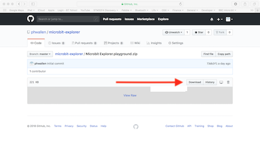

# Overview
# Installation
## Install the Micro:bit Explorer Playground
To run the Micro:bit Explorer you will need an iPad capable of running Apple's Swift Playgrounds App. If the App is not installed on your iPad, go to the App Sore and search for **Swift Playgrounds**. It's free to download.

Once the Swift Playgrounds App is installed, using the web browser on your iPad, go to  [github.com/phwallen/microbit-explorer](https://github.com/phwallen/microbit-explorer/)
and click on file **Microbit Explorer.playground.zip**.  

Press the **Download** button to download the file to your iPad

When the Micro:bit Explorer Playground has been downloaded;  tap **Open in "Playgrounds"**

## Flash the Micro:bit with the Explorer Program
Micro:bit Explorer requires a special program to run on the Micro:bit.

You will need to use a computer with a USB connection.

Connect the Micro:bit to your computer using a suitable USB cable.

Using the web browser on your computer, go to  [github.com/phwallen/microbit-explorer](https://github.com/phwallen/microbit-explorer/) and click on file **Microbit Explorer.hex.zip**

Press the **Download** button to download the file to your computer.

Now you can 'Flash'  the Micro:bit Explorer program to the Micro:bit.

If you are not familar with flashing programs  to the Micro:bit read this simple guide - [Using micro:bit in 5 easy steps](http://microbit.org/guide/quick/). and just follow the instructions in **Step 3**

When the Micro:bit Explorer program has been flashed, the Micro:bit will display **R** on the LED matrix.

