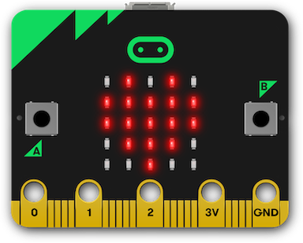
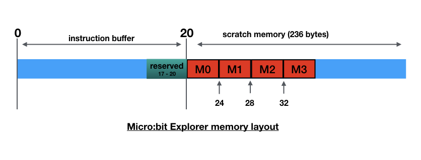

# Overview
The micro:bit is a tiny programmable computer, designed to make learning and teaching fun. It’s clever design and it’s supporting software makes it easy to get started, and, with endless possibilities, makes it ideal for students, hobbyists and designers.

The Micro:bit Explorer Project is an attempt to get to the heart of the micro:bit - its application processor - exposing some of its registers, and, demonstrating how a digital computer works.

The Micro:bit Explorer is packaged as a Swift Playground Book that runs on any iPad that supports Apple’s Swift Playgrounds application, a free download from the Apple App Store.

The Micro:bit Explorer allows students to:

- enter machine code through a hex keypad and see how registers are affected.
- enter values through the keypad and store them in the micro:bit’s memory.
- write simple commands to execute machine code and change memory.
- create programs using a simple integrated assembler and watch as code is progressed through the processors pipeline as it fetches, decodes and executes.

The Micro:bit explorer is  a way of introducing computer fundamentals in a visual way without the need for, possibly, extensive software tool setup.  It may be, after initial experimentation, students will want extend their studies with software tools such as OpenOCD or pyOCD and, perhaps, write some assembler code using the MicroPython inline assembler or use the ARM toolchain.

*Figure 1 The Micro:bit Explorer Swift Playground*

The Micro:bit Explorer is divide into 4 views (or windows).  Figure 1 shows the first 3 views :

- The processor view shows:
 	- the contents of registers 0 - 7. 
	- the address in the stack pointer register.
	- condition code flags in the Application Program Status Register.
	- the last machine code instruction(s) to be executed.

- The keypad view allows either a hexadecimal or 16 bit binary value to be entered.  The 	value entered can be executed  as one or more (maximum 8) machine instructions or 	stored as a value (maximum 32 bits) in one of 4 memory locations.

- The code area, a feature of Swift Playgrounds, is where Swift code can be written and 	tested. This will predominately be used for entering  a small set of commands 		(Swift functions) as an alternative to entering values through the keypad. Each 	time the ‘Run My Code’ button is tapped, the commands will be executed in sequence

Figure 2 shows the pipeline view, allowing students to simulate machine cycles. Each cycle fetches, decodes and executes the machine code created when the **program()** function is run. Unlike the execute() function which executes an entire sequence of instructions (maximum 8) on the Micro:bit, the program() function passes each instruction from a stored program individually during the execute phase of the pipeline. Instructions that influence the Program Counter (e.g. branch instructions) are simulated and not passed to the Micro:bit. There is no theoretical restriction on the size of the code using the program() function.

*Figure 2 The Pipeline View*

The **assemble()** function can be used with the program() or execute() functions as an alternative to directly supplying machine code. The built-in assembler has a number of restrictions, but should process source similar to that used by the GCC tools, and, output suitable Thumb machine code for the Micro:bit's ARM processor.



*Figure 3 Register status indicators*

After instruction(s) have executed, the LEDs on the Micro:bit indicate the contents/status of some of the registers. The first 4 rows show the 5 least significant bits of registers 0 - 3, while the first 4 (from the right) LEDs of the bottom row indicate the condition flags in the program status register. For example, in figure 3, the LEDs indicate:

- Register 0 - 0b01010 (10)
- Register 1 - 0b11111 (31)
- Register 2 - 0b11111 (31)
- Register 3 - 0b01110 (14)
- Program Status Register -  N clear, Z set, C clear,  V clear

# Installation
## Install the Micro:bit Explorer Playground
To run the Micro:bit Explorer you will need an iPad capable of running Apple's Swift Playgrounds App. If the App is not installed on your iPad, go to the App Store and search for **Swift Playgrounds**. It's free to download.

Once the Swift Playgrounds App is installed, using the web browser on your iPad, go to  [phwallen.github.io/Microbit-Explorer.playgroundbook.zip](https://phwallen.github.io/Microbit-Explorer.playgroundbook.zip)

When the Micro:bit Explorer Playground has been downloaded;  tap **Open in "Playgrounds"**

## Flash the Micro:bit with the Explorer Program
Micro:bit Explorer requires a special program to run on the Micro:bit.

You will need to use a computer with a USB connection.

Connect the Micro:bit to your computer using a suitable USB cable.

Using the web browser on your computer, go to  [download Microbit Explorer.hex](https://phwallen.github.io/Microbit-Explorer.hex).

Now you can 'Flash'  the Micro:bit Explorer program to the Micro:bit.

If you are not familiar with flashing programs  to the Micro:bit read this simple guide - [Using micro:bit in 5 easy steps](http://microbit.org/guide/quick/). and just follow the instructions in **Step 3**

When the Micro:bit has been flashed, it will display **R** on the LED matrix.

#Features
The following sections outline the main features of the Micro:bit Explorer Swift Playground. They include examples that can be copied and pasted into the Playground that demonstrate key aspects. 

*It should be possible to use a selection of these features, with appropriate narrative, to provide content to future editions of a Playground book based on specific teaching requirements.* 
 
##The hex keypad
Connect the Micro:bit to a suitable power supply and ensure **R** is displayed on the LED matrix.

Open the **Micro:bit-Explorer** playground book in the Swift Playgrounds App.

Tap the **Connect Micro:bit** button.

Select the correct micro:bit from the drop-down panel. The panel will list all micro:bits in the vicinity. You will need to identify the correct one by its 5 character suffix, for example: [zuvev].

If connection is established, the connect button will change to show the connected micro:bit, for example: **BBC micro:bit [zuvev]** and the micro:bits LED matrix will be blank.

Now we are ready to get the micro:bit's processor to do some work.

Using the Hex Keypad (make sure 'Hex Keypad' is highlighted) enter **2001** and press the blue **Execute** button.

If everything is working correctly the following should have happened:

- the processor instruction buffer shows 2001
- register 0 shows the value 1
- the top righthand LED on the micro:bit lights.

and you have just executed the machine instruction move the value **1** into register **0**.

We will discuss machine instructions a lot further later. For the purposes of getting started just remember that the majority of instruction that run on the micro:bit processor are 16 bits long and they can be represented by 4 hexadecimal characters. **Move immediate** instructions (immediate just means the value to be moved is contained within the instruction) start with the hexadecimal value **2**. The next character is a register in the range 0 - 7 and the final 2 characters represent the immediate value. Hence **2001** means move into register 0 the value represented by hexadecimal 01.

Try the following, press the 'All Clear" blue key on the keypad to remove the instruction just entered and type **2141 2202 2303 2404 2505 2606 2700**. Now press the blue **Execute** button.

You should see the following:

- The processor instruction buffer shows 2141220223032404250526062700. This is the same as you entered on the keypad  without any spaces. The spaces on the keypad are only to enhance readability and are not passed to the micro:bit.
- Register 0 still contains the value 1. This is the result of the previous test when you entered 2001. The state of the registers from previous instructions is not lost unless you clear the micro:bit by pressing the reset key or running the clear() function (we will discuss clear() later).
- Register 1 contains the value 41 (decimal 65). It also shows the unicode representation of this value which happens to be the character 'A'.
- Registers 2 - 7 show the corresponding values used in the operands of the executed instructions i.e. 2,3,4,5,6,0.
- The program status register has highlighted the 'Z' flag. This is because the last instruction executed was 2700 which caused the state of register 7 to be zero.
- The LEDs on the micro:bit display the the values of the 5 least significant bits of registers 0 - 3. Note that the second row (representing register 1) only shows the least significant bit despite register 1 containing hexadecimal 41 (0b01000001).
- Row 5 of the LED matrix on the micro:bit shows the 3rd LED from the right is on, representing the the program status register 'Z' flag.

You can enter a maximum of 8 machine instructions to be passed for execution on the micro:bit. This allows short sequences or snippets of code to be examined, however, typing this number of instructions can be pain, and, as we will see later, using assembler mnemonics is easier and far more readable. 

Hint: When using the keypad, you might find it easier to work in full screen mode by swiping from the centre of the screen.

At this point, it's probably worth emphasising that whatever instructions you send to the micro:bit, the processor will execute even if they are inappropriate. So, be prepared to do a 'hard' reset i.e. switch the micro:bit off and on again.

Most software will do its best to prevent users from crashing programs, but, this is a playground book designed to explore and try things out. If you tell the micro:bit processor to jump, it will, and if you tell it to jump somewhere it shouldn't, it still will and you will get 'unexpected results' - I mean crash!

Luckily, the micro:bit is an excellent place to experiment. A crash won't do any permanent damage, important code is protected in flash memory (read-only memory), so something going wrong, at worst, means restarting the micro:bit.

Now we know that, let's do what we shouldn't! Using the hex keypad:

- press the 'All clear' button
- enter **E001**
- press **Execute**

Chances are, the micro:bit will lose communication with the playground. Even pressing reset won't clear the problem. You executed a command that tells the processor to advance its program counter 1 instruction (2 bytes) and execute that instruction. We don't know what that instruction is and, more importantly, what other instructions it might process on its way to mayhem. 

You can try pressing the reset, but, you might have to turn the micro:bit off and on and remember to reconnect the playground with the micro:bit.  

##The binary keypad

The application processor (Nordic nRF51822) on the micro:bit is better described as a SoC (system on chips). It is like a motherboard in a desktop computer, but contained in one tiny integrated circuit. The SoC has random access memory (RAM), permanent storage (Flash ROM), interfaces to connect to the outside world and, of course, a central processing unit (CPU).

The CPU is an ARM designed Cortex-M0 32-bit RISC (reduced instruction set computing) processor. The Cortex-M0 implements the ARMv6-M architecture and the Thumb instruction set. For a highly technical description of this architecture and the instruction set see the:
[ARMv6-M Architecture Reference Manual](https://static.docs.arm.com/ddi0419/d/DDi0419D_armv6m_arm.pdf).

The majority of instructions in the Thumb instruction set are 16 bits long, the Microbit Explorer binary keypad has been designed to help users experiment with the use of Thumb instructions. 

As an example, let's try executing the **ADD (immediate)** instruction.

Details of all Thumb instructions and their encodings can be found in the section **Alphabetical list of ARMv6-M Thumb instructions** of the [ARMv6-M Architecture Reference Manual](https://static.docs.arm.com/ddi0419/d/DDi0419D_armv6m_arm.pdf).

If you find the ADD (immediate) instruction you'll see it has 2 possible encodings. **Encoding T1** takes operands of a source register and a 3 bit immediate value and **Encoding T2** takes an 8 bit immediate value. For this example we will use **T2**.

```
Add (immediate) T2 Encoding
15 14 13 12 11 10 9 8 7 6 5 4 3 2 1 0
0  0  1  1  0 | Rdn  |     imm8

where:
     Rdn  = the destination register
     imm8 = an 8 bit value 
```

Using the Micro:bit Explorer playground select **Binary Keypad**

Using the above encoding: -

- Bits 13 and 12 are set to 1, so tap **13** and **12** on the keypad, the keys should turn red indicating those bits are set.
- Bits 10,9 and 8 specify the destination register, we will use register 2 (0b010), so tap **9** on the keypad.
- Bits 7 - 0 specify an 8 bit binary value to be added to the destination register, we will use 5 (0b00000101), so tap **2** and **0**.

You should see **3205** in the keypad display, which is the hex value for the instruction.

Press the **Execute** button to ADD 5 to register 2.

##Modify memory using the keypad

The nRF51822 SoC has 16K RAM onboard. The Microbit Explorer is capable of modifying a small area of 16 bytes specified as 4 x 4 byte words using the keypad. This allows memory to be initialised with values to facilitate the demonstration of instruction behaviour e.g. seeding registers from a constant.

Values up to 32 bits (8 hex characters) can entered using the Hex keypad and values up to 16 bits can be entered using the Binary keypad.

For example to enter the value of 0x7F0403FF in memory location M0:

- set the keypad to Hex Keypad
- enter value **7F0403FF** using the keypad
- press the M0 blue button

The appropriate memory in the micro:bit will be modified and the value reflected in the **Memory - M0** field at the bottom of the Processor View.

You will notice that the value is displayed as: **FF03047F**. This is because values in the micro:bit are stored in **little-endian** format. When values are stored in little-endian, the least significant byte is stored in the lowest address and the most significant byte is stored in the highest address allocated to a memory field (in this case a 32-bit (4 byte word). 

For example, assume the M0 field is a 4 byte area starting at address 0x00000020 and ending at address 0x00000023. The least significant byte of 0x7F0403FF is FF so that is stored in the lowest address 0x00000020. The next least significant byte is 03 so that is stored in the next lowest address 0x00000021. Then comes 04 stored in 0x00000022 and finally 7F is stored in the highest address 0x00000023.

Once a value has been stored it can be accessed, manipulated and possibly re-written, by the processor instructions. 

Assuming you have stored the value 0x7F0403FF in the M0 field, execute the instruction **4804**.

You should see that register 0 contains 0x7F0403FF, the value stored in the M0 word.

The instruction you executed was to load register 0 with the value stored in memory at an address that is 4 words (16 bytes) after the address stored in the program counter. Using an offset from the program counter makes the instruction relocatable. When the instruction, and its program is loaded into memory, it doesn't matter where in memory it is loaded, only that the value the instruction is accessing is 16 bytes after program counter.  

The reason the M0 field is 16 bytes after the program counter requires a bit more explaining as to how the Micro:bit Explorer program runs on the micro:bit. You may want to skip the following explanation for the time being and just remember:

- **4804** loads register 0 with the value in **M0**
- **4805** loads register 0 with the value in **M1**
- **4806** loads register 0 with the value in **M2**
- **4807** loads register 0 with the value in **M3**

*Figure 4 - Microbit-Explorer memory layout*

When instruction(s) are sent to the micro:bit from the Swift Playground they are placed in the instruction buffer (see figure 4). The buffer is 20 bytes long, the last 4 bytes are reserved, meaning a maximum of 8x2 byte instructions can be executed from the buffer. At the end of the buffer is a storage area available for the instructions in the buffer to access. The first 4 words (16 bytes) are named M0, M1, M2, M3.

As previously mentioned, the data stored at the end of the buffer is accessed via an offset from the program counter. We will see later the program counter points to 2 instructions passed the one currently being executed. Therefore, assuming the current instruction is at address 0, the program counter will be pointing at 4 (remember each instruction is 2 bytes). As M0, the area we are trying to read, is at 20, the offset from the current program counter is: 20 - 4 = 16. If we wanted to access M1 the offset world be: 24 - 4 = 20 and so on.

So far; so good? But - things get more hairy when we workout the offset for the second instruction in the buffer. You would be forgiven for thinking the offset to access M0 would be 14, because the program counter would have incremented by 2 bytes, but, this is not the case. To ensure word alignment the offset remains the same as the previous instruction i.e. 16. These strange quirks are not usually a programmers concern, as it's the job of the assembler to calculate these values. For the purpose of this explanation use the following table to obtain the program counter offset for each of the instructions in the buffer:

```
Instruction     PC Offset to M0    PC Offset to M0 
                   (in bytes)        (in words)
     1                16                  4
     2                16                  4
     3                12                  3
     4                12                  3
     5                 8                  2
     6                 8                  2
     7                 4                  1
     8                 4                  1
``` 

If you were writing the assembler statement to load the value at M0 into register 0, it would be: **LDR R0,[PC,#16]**, however, the machine code instruction uses words rather than bytes for its offset value. Therefore the equivalent machine instruction contains an immediate value of: 16 / 4 = 04. Hence the instruction is encoded as **4804**.

Suppose we want to code a sequence of instructions that loads register 0 with M0, register 1 with M1, register 2 with M2 and register 3 with M3. From the table above we see the PC offsets to M0 are 4,4,3 and 3 for each of the 4 instructions respectively. We then need to add 1 for M1, 2 for M2 and 3 for M3, giving the 4 offsets as: 4 + 0 = **04**, 4 + 1 = **05**, 3 + 2 = **05**, 3 + 3 = **06**. Given that the first byte of the load instruction is: **48** for register 0, **49** for register 1, **4A** for register 2 and **4B** for register 3, the sequence of instructions we would code is:

**4804 4905 4A05 4B06**

##Commands

So far, we have used the keypad to interact with the micro:bit's processor. As an alternative you can write commands that execute machine code and modify memory. This has the advantage of recording reproducible sequences which can be copy and pasted into the Playgrounds command area.

###execute

In the same way you can enter one or more machine instructions using the keypad, the **execute** command allows you to write a string of characters representing a maximum of 8 instructions to be executed. Each instruction must be 4 hexadecimal characters although spaces can be used to improve readability.

The **execute** command takes 1 parameter:

- A String containing a maximum of 8 machine code instructions using hexadecimal notation.

The following command executes the machine instruction **3001** (add 1 to the contents of register 0) on the micro:bit's processor.
```
execute("3001")
```
To run the command tap **Run My Code**

Each time the command is executed the value in register 0 will be incremented by 1.

The following command increments all 8 registers by 1.
```
execute("3001 3101 3201 3301 3401 3501 3601 3701")
```
As the commands are Swift function calls, they can be used in conjunction with other swift statements. For example, the following would increment register 0, 10 times.
```
execute("2000") //clear reg 0
for _ in 1 ... 10 {
    execute("3001") //add 1 to reg 0
}
```
A feature of Micro:bit Explorer is, values greater than 32 in register 7 are displayed on the micro:bit as an ASCII character. The following code will sequence through the micro:bit's ASCII font.
```
execute("2720") // set ASCII space
for ascii in 33 ... 127 {
    execute(String(format:"27%02X",ascii))
}
```

###clear
The state of the registers is preserved across command execution. To reset the processor you can either press the micro:bit's reset button (remember to reconnect the micro:bit by pressing the **Connect Again** button) or you can run the the clear command.
```
clear()
```
Placing **clear()** at the start of a sequence of commands will ensure consistency when rerunning the sequence.
```
clear()
execute("3001")
execute("3001")
```
###writeMemory
The writeMemory command changes the value in one of the four memory words - M0, M1, M2, M3. It takes 2 parameters:

- location: an integer in the range 0 - 3 representing memory words M0,M1,M2,M3
- value: a 32 bit unsigned value

The following command writes the value **255** (hex **FF**) to **M0**:
```
writeMemory(location: 0, value: 255)
```
This command could also be written as:
```
writeMemory(location:0,value: 0xFF)
	or
writeMemory(location:0,value: 0b11111111)
```
A special form of the writeMemory command allows you to specify a signed integer rather than the 32 bit unsigned integer used above. The 2 parameters are:

- location: an integer in the range 0 - 3 representing memory words M0,M1,M2,M3
- number: a 32 bit signed integer

```
writeMemory(location: 0, number: -1)
           gives the same result as
writeMemory(location: 0, value: 0xffffffff)
```

##Assembler

So far, we have interacted with the micro:bit's processor using the language it understands - machine code. It's probably an understatement to say that this can be difficult to understand by humans. Programmers use languages which are easier to read and write, then use software tools like compilers to covert program statements into the inevitable machine code. The nearest a human will usually need to get to machine code (unless they are writing translation tools such as compilers) is using an Assembler. This tool has a one-for-one relationship between a relatively readable statement preferred by a human and an equivalent machine code required by a computer's processor. Unlike higher level languages, that strive for portability allowing programs to run on many types of machines from different manufactures, assembler language code tends to be tied to specific processors or groups of processors. The micro:bit uses an ARM processor which implements a subset of the ARM Thumb instruction set. Only assemblers that can generate codes that conform to this instruction set are appropriate for generating code for the micro:bit. 

The Micro:bit Explorer includes a 'lightweight' assembler that generates the 16 bit machine code the micro:bit's processor can understand. It uses a syntax that is similar to that used by the GCC tool set, however only the Thumb syntax is supported (not the Unified Assembler Language syntax).

The **assemble** command takes 1 parameter:

- A String containing Thumb assembler source statements. Each statement must be separated by a newline character.

The following shows an example of using the assembler.

```
let source = """
   mov r0, #255 @ initialise reg 0
   lsl r0,r0,#1 @ multiply by 2
loop:
   sub r0,#1 @ decrement reg 0
   bne loop
"""
let machine_code = assemble(source)
```

Output from the assembler is a String that is compatible with the execute and program commands (see the next section for a description of the program command). The following shows a simple divide routine being assembled and executed using the assemble and execute commands. Note that the routine contains 8 assembler statements, generating the maximum number of instructions allowed by the execute command. This restriction is lifted when using the program command.
```
let divide_routine = """
@ divide by subtraction
@ at the end of the routine
@ reg 3 contains the quotient
@ reg 4 contains the remainder
   mov r1,#97 @ dividend
   mov r2,#42 @ divisor
   mov r3,#0  @ initialise quotient
loop:
   add r3,#1  @ increment the quotient
   sub r1,r1,r2  
   bpl loop
   sub r3,#1  @ correct premature update
   add r4,r2,r1 @ set remainder
"""
let machine_code = assemble(divide_routine)
execute(machine_code)
```
It should be noted the assembler has the following known differences from the ARM assembler:

- register assumptions are not made. e.g. the ARM assembler will assume the source and destination registers are the same in an ADD and SUB instruction, if the source register is omitted. The Micro:bit Explorer assembler requires all 3 registers to be coded e.g. SUB R1,R1,R2
- register ranges are not supported. e.g. PUSH {R1 - R4} must be coded as PUSH {R1,R2,R3,R4}. N.B. PUSH {R1 - R4} will be interpreted as PUSH {R1,R4}.
- REV16 mnemonic is replaced by REVH.
- BKPT is not supported.
- instructions manipulating Hi registers 8 - 12  are not supported. 
- ARM assembler directives are not supported.

In general, parameter checking is not as stringent as the ARM assembler, therefore, it is possible that invalid source may be interpreted incorrectly and not cause a syntax  error.

##Pipeline Processing

The instruction pipeline is a fundamental design feature of ARM processors. It allows the processor to, almost simultaneously, do its three key tasks of fetching, decoding and executing.

The **program** command has been designed to illustrate the pipeline process. Although similar to the **execute** command, in that you pass it a String of machine instructions, it differs in that it executes each instruction individually rather than passing the whole sequence to the micro:bit in one go. This allows you to step through the instructions illustrating how each machine cycle performs the three stages of the pipeline.

The program command removes the restriction of a maximum of 8 instructions, however, as each instruction is passed individually to the micro:bit it slows the execution considerably. Branch instructions are not executed on the micro:bit. Their operation is simulated in the Playground, changing the flow of a program when a branch is taken.

The following code (a slightly more sophisticated version of the divide routine used in the previous section) uses the program command to demonstrate the ARM pipeline on the micro:bit processor.
```
let divide_routine = """
@ on completion 
@ register 0 contains the quotient
@ register 1 contains the remainder
   mov r1,#97 @ dividend
   mov r2,#42 @ divisor
   mov r0,#0  @ clear quotient
   mov r3,#1  @ initialise pointer
start:
   lsl r2,r2,#1
   lsl r3,r3,#1
   cmp r2,r1
   bls start
next:
   cmp r1,r2
   bcc skip
   sub r1,r1,r2 @ execute if carry set
   add r0,r0,r3 @ execute if carry set
skip:
   asr r3,r3,#1
   bcs carry_set
   asr r2,r2,#1 @ execute if carry clear
carry_set:
   bcc next
   mov r7,#69 @ indicate end
"""
let machine_code = assemble(divide_routine)
program(machine_code)
```  
When you press **Run My Code**, providing there are no errors in the assembler code, the program command loads the entire program, . If errors are detected an error report pop-up will be displayed and the program will not load. Once loaded, you can simulate one machine cycle at a time and watch how instructions flow through the pipeline, using the red Cycle button.

The following walkthroughs the above program as code passes through the stages of the pipeline.

- Press **Run My Code**. The message **Program ready to run** is displayed. Press **OK**. The program counter shows **0** indicating the next instruction to be fetched, in this case the first. (Note: for clarity, the program counter shows the number of the instruction rather than its address in memory).
- Press the red **Cycle** button to simulate one machine cycle. The first machine instruction **2161** is fetched from memory. The program counter is incremented to point to the next instruction to be fetched i.e.**1**, (the second instruction). As there are no instructions in the Decode or Execute parts of the pipeline no other work is done in this machine cycle.
- Press the **Cycle** button  again. Instruction **222A** is fetched and the program counter is incremented. This time the instruction fetched from the previous cycle is moved through the pipeline to the Decode section and the machine code **2161** is decoded to **MOV r1,#97** enabling the processor to prepare for how the instruction will execute. There is still no instruction in the Execute section, so no other work is done in this machine cycle.
- Press **Cycle**. Instruction **2000** is fetched. The program counter is incremented. Instruction **222A** is decoded and **MOV r1, #97** is executed. You will see that register 1 now contains *97*  and the first LED on the second row of the micro:bit is switched on indicating bit 1 of register 1 is set. This is the first machine cycle where the pipeline is full and all three stages of Fetch, Decode and Execute have occurred in the same cycle.
- Press **Cycle**. Instruction **2301** is fetched. **MOV r0,#0** is decoded. **MOV r2,#42** is executed. Register 2 contains 42.
- Press **Cycle**. Instruction **0052** is fetched. **MOV r3,#1** is decoded. **MOV r0, #0** is executed. 
- Press **Cycle**. Instruction **005B** is fetched. **LSL r2,r2,#1** is decoded. **MOV r3,#1** is executed.
- Press **Cycle**. Instruction **428A** is fetched. **LSL r3,r3,#1** is decoded. **LSL r2,r2,#1** is executed.
- Press **Cycle**. Instruction **D9FB** is fetched. **CMP r2,r1** is decoded. **LSL r3,r3,#1** is executed.
- Press **Cycle**. Instruction **4291** is fetched. The program counter is incremented to **9**. **BLS -5** is decoded (branch back 5 instructions, from the current program counter, if lower or the same). This is the first sign of trouble ahead. So far we have been sequentially stepping through the program's instructions, but now there is a possibility this flow could be disrupted. **CMP r2,r1** is executed setting the program status register flag **N** and clearing the other flags.
- Press **Cycle**. **BLS -5** is executed. This instruction will branch, subtracting 5 from the program counter because the C flag in the program status register is clear. The program counter is changed to **4**. This means that anything in the Fetch and Decode stages of the pipeline are now invalid. A couple of machine cycles will be needed to refill the pipeline.
- Press **Cycle**. Instruction **0052** is fetched. The Decode and Execute stages are empty so there is no more work in this machine cycle.
- Press **Cycle**. Instruction **005B** is fetched. **LSL r2,r2,#1** is decoded. There is nothing to execute.
- Press **Cycle**. The pipeline has recovered from the disruption caused by the branch and it is full again. Instruction **428A** is fetched. **LSL r3,r3,#1** is decoded. **LSL r2,r2,#1** is executed.
- Press **Cycle**. Instruction **D9FB** is fetched. **CMP r2,r1** is decoded. **LSL r3,r3,#1** is executed.
- Press **Cycle**. Instruction **4291** is fetched. **BLS -5** is decoded. We are back to 'branch if lower or the same'. **CMP r2,r1** is executed this time setting the program status register flag **C**.
- Press **Cycle**. This time, because the **C** flag is set, no branch occurs. This is good news for pipeline as previous values it had fetched and decoded remain valid. 

You can continue to press the **Cycle** button until the routine finishes with the instruction **mov r7,#69**. This moves **69** into register 7 and displays **E** on the micro:bit's LED display. Hopefully, at the end of the routine, register 0 contains 2 and register 1 contains 13 (i.e. 97 / 42 = 2 reminder 13). If you prefer, you could switch the **Auto** switch. This will automatically cycle through the program at a rate of approximately one instruction per second. The speed can be adjusted from about 1 instruction every 2 seconds to about 3 instructions a second.
##Interupts
An important part of any digital computer design is the ability to handle interrupts, effectively stoping what it is currently doing, perform another task and return to the previous task.  The Micro:bit-Explorer program is designed to demonstrate this feature by intercepting events generated by pressing Button A or Button B on the micro:bit.

The way the event is treated depends on which button is pressed.

- **Button A** - If the micro:bit is processing instructions sent using the execute command or execute key, and Button A is pressed, the sequence is interrupted and the state of the registers is displayed at the time of the interruption.
- **Button B** - Pressing Button B will always cause the bottom left LED to light and all other LEDs to be turned off. If the micro:bit is processing instructions, they will be temporarily halted, while the LED matrix is updated and, then, the processing of the interrupted instructions will continue.

The following code performs a loop 255 * 2^16 (16,711,680) times. Each pass of the loop requires 4 machine instructions (1 for the subtract and 3 for the branch). As the micro:bit can process 16 million instructions a second, the loop should run for 16,711,680 x 4 / 16,000,000 i.e. about 4.2 seconds. In practice it's a bit longer than that because of the overhead of transmission time between the iPad and the micro:bit at the start and end of the sequence.

```
let source = """
    mov r0,#255
    lsl r0,r0,#16 @multiply by 2^16
loop:
    sub r0,#1
    bne loop    
```

Tap Run My Code, the Processor window should indicate its busy for about 4.5 seconds before showing the Z and C flags set as a result of register 0 becoming zero. Now, tap Run My Code again, and within the busy time press **Button B**. The LED display is cleared and the bottom left hand corner LED is turned on, however, the loop continues to execute following the interrupt. Once register 0 is zeroed, the loop ends and the LED display shows the Z and C flags.

In this next example we'll interrupt processing using Button A. Assuming register 0 is zero (if not, use the hex keypad to clear Register 0 e.g. tap in **2000** and press execute), tap in the following **3801D1FD** and press execute. This is the final 2 instructions from the example above:
```
 loop:sub r0,#1
 bne loop
```
In this example, the loop executes for 2^32 times (4,294,967,296). Using the same calculation from above, that means: 17,179,869,184 machine cycles. In other words 1074 seconds or 17 minutes 54 seconds (In practice it will probably take about a minute longer due to interruptions caused by the micro:bit's runtime system). When you press **Button A** the countdown is interrupted and the current register state is displayed including how far the countdown has gone in register 0. Press the **execute** key again and the countdown continues.
